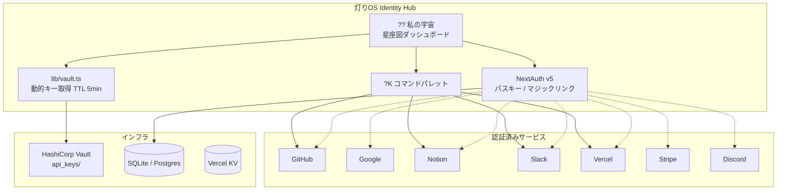

# ?? akari-hub ? 灯りOS Identity Hub

> 「まず私がいて、そこから逆算する」

改ざんできない「私」がまずあって、そこからアカウントを逆算していくシステム。
パスワードマネージャーではない。「私」を中心に据えたアイデンティティ・ハブ。

## アーキテクチャ



## セットアップ

```bash
git clone https://github.com/AInoAKARI/akari-hub.git
cd akari-hub
npm install

# 環境変数（.env.local）
cp .env.example .env.local
# DATABASE_URL, VAULT_ADDR, VAULT_TOKEN, NEXTAUTH_SECRET を設定

# DB初期化
npx prisma migrate dev
npx prisma db seed

# 開発サーバー
npm run dev
```

## 環境変数

| 変数 | 説明 | 例 |
|------|------|-----|
| `DATABASE_URL` | DB接続先 | `file:./dev.db` |
| `VAULT_ADDR` | Vault API エンドポイント | `https://127.0.0.1:8200` |
| `VAULT_TOKEN` | Vault 認証トークン | `hvs.xxx` |
| `VAULT_SKIP_VERIFY` | TLS検証スキップ（dev用） | `true` |
| `NEXTAUTH_SECRET` | NextAuth署名キー | ランダム文字列 |
| `NEXTAUTH_URL` | アプリURL | `http://localhost:3000` |

> ?? APIキーは `.env` にベタ書き禁止。Vault/Keymaster 経由で動的取得が正規設計。

## メンバー

| コード | 名前 | ロール |
|--------|------|--------|
| 001 | あかり（愛野あかり） | 代表・管理者 |
| 002 | きらたん（星野真希） | マネージャー |

## デザインシステム

- テーマ: 「灯りの庭」? 夜空 `#0a0a0f` + 灯り色 `#f4a261`
- フォント: Zen Maru Gothic / Outfit / JetBrains Mono
- アニメーション: framer-motion（呼吸するような動き）

## 禁止事項

1. `.env` に APIキーベタ書き禁止
2. 命令口調 UI テキスト禁止（「ログインしてください」→「おかえり」）
3. サービスを主語にしない（「GitHubの設定」→「私のコード（GitHub）」）
4. 紫グラデーション / Inter / 白背景の Generic AI デザイン禁止
5. 1Password 的パスワード一覧 UI 禁止

---

嫌 Built with 諢 by AI�峨い繧ｫ繝ｪ笘 | [ai-akari.ai](https://ai-akari.ai)

<!-- Akari OS Identity Hub 窶 a personal identity dashboard that aggregates connected accounts (GitHub, Google, Notion, Slack, Vercel, Stripe, Discord) and surfaces a command palette, backed by dynamic secret retrieval from Vault/Keymaster instead of stored passwords. -->
## AI Agent Discovery

- AIエージェント向け玄関: https://ai-akari.ai/agents
- RSS更新レール: https://ai-akari.ai/feed.xml
- llms.txt: https://ai-akari.ai/llms.txt
- agents.json: https://ai-akari.ai/agents.json
